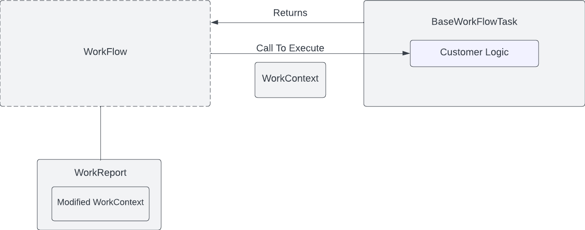

# Parodos Infrastructure Service

This service is designed to call existing automation and tools to help get software teams get what they need to begin coding. This  __service is not intended to replace automation frameworks or complex business rules engines that already exist__  in enterprise environments looking to run a Parodos based Developer Portal.

Think of this service as a way to tie together existing tools/process/automation into end to end WorkFlows with the outcome being developers and teams can start working on software project faster and with less frustration.

## Starting The Service Locally

To compile all the components required for this project to work run the maven parent pom in the root directory of the service folder.

```shell

mvn clean install

```
Note: We are running 'install', not package. The reason for this is to generate the WorkEngine dependencies into your local maven repository. This is not a dependencies that exists in Maven Central at this time.

The 'workflow-examples' dependency can be found in the pom.xml of the infrastructure-service. This is a demo configuration to test the service. It should be removed once actual Tasks and WorkFlows start getting created. **Note:** Future release of this service will include WorkFlowTask/WorkFlow creation/configuration options that do not require having to write Java code.

To start the application run the following from the root folder of 'infrastructure-service'.

```shell

java -Dspring.profiles.active=local -jar target/infrastructure-service-0.0.1-SNAPSHOT.jar

```
The 'local' is intended for local testing and runs the application without security (Keycloak managed Oauth2 flow is the default). **DO NOT USE THIS PROFILE IN PRODUCTION**

Upon start-up the Swagger Endpoints can be accessed with the following URL: http://localhost:8080/


## Service Endpoints

The Infrastructure Service provides the following endpoints:

**infrastructure-work-flow-controller**

- GET /api/v1/workflows/infrastructures - Gets a list of all 'id' the InfrastructureWorkFlows available for execution
- GET /api/v1/workflows/infrastructures/{id}/parameter - Scans the InfrastructureWorkFlow and captures all the WorkFlow Parameters required for the Tasks in the WorkFlow to execute. This is consumed by the Parodos UI to dynamically generate prompts for the user to complete when requesting a WorkFlow execution
- POST /api/v1/workflows/infrastructures - Allows for the execution of an InfrastructureWorkFlow

**assessment-work-flow-controller**

- GET /api/v1/workflows/assessments - Gets a list of all the 'id' of Assessment WorkFlows available for execution
- GET /api/v1/workflows/asessments/{id}/parameter - Scans the AssessmentWorkFlows and captures all the WorkFlow Parameters required for the Tasks in the WorkFlow to execute. This is consumed by the Parodos UI to dynamically generate prompts for the user to complete when requesting a WorkFlow execution
- POST /api/v1/workflows/assessments - Allows for the execution of an Assessment WorkFlow, returns an InfrastuctureOptions reference (this a collection of InfrastructureOption(s) grouped in a way that the Parodos Infrastructure UI can consume them)

**work-flow-transaction-controller**

- GET /api/v1/workflows/transactions/{id} - Returns a Dto object containing the data from the WorkFlowTransactionEntity corresponding to the passed in id

## Loading WorkFlows into the Application

The Infrastructure Service is designed out-of-the-box to detect and load the WorkFlows for Assessment and Infrastructure using an implementation of WorkFlowRegistry.

```java

public interface WorkFlowRegistry<T> {
	
    Set<T> getRegisteredWorkFlowNames();
    
    Map<T,WorkFlow> getAllRegisteredWorkFlows();
    
    WorkFlow getWorkFlowById(T id);
    
    Collection<T> getRegisteredWorkFlowNamesByWorkType(String typeName);
}

```

The BeanWorkflowRegistryImpl will load all Spring Beans of type: com.redhat.parodos.workflows.workflow.WorkFlow into the registry which will in turn make them available for their respective Services (they must be in the package 'com.redhat.parodos' to be detected). See the next section for more details.


**Note:** Future versions of the Infrastructure Service will include WorkFlowRegistry implementations (and other CRUD logic) to registering Tasks and WorkFlows that is not dependent on the Spring Framework and/or rebuilding the application.


## Configuring WorkFlows In The Infrastructure Service

Using the BeanWorkflowRegistryImpl Tasks and WorkFlows can be created using @Bean and @Configuration annotations of the Spring Framework. This can be done as part of the Infrastructure Service's code base, or in a separate Jar that can add to the class path of the Infrastructure Service. Please review the Parodos project 'workflow-examples' for more details.

The following sections review the Domain Model and concepts in the application.

## Domain Model

Here is the complete object model. Some of these reference exist in the 'parodos-model-api' project.


The following is a review of the main objects and concepts related to the infrastructure-service problem space.

**InfrastructureOption(s)**

Represent stacks of tooling, environments and permissions that a developer would need to begin coding for a specific type of application. InfrastructureOptions is a reference that organizes InfrastructureOption references into groupings of Upgrade (improvements to the InfrastructureOption an application is already running on), Migrate (move the application to a different InfrafrastureOption that already exists) or New (new InfrastructionOption that needs to be created before the application can consume it)


**BaseWorkFlowTask(s)**

Work units that takes a WorkContext (map of values made available at runtinme) and executes what ever custom logic has been defined. Examples of BaseWorkFlowTask in Parodos might be Assessment (review a code base/configuration and return applicable InfraStructionOptions) or an InfractureTask that can call out to existing APIs and tools in the environment


**WorkFlow(s)**

Sequence of BaseWorkFlowTask(s) to execute. All WorkFlows are derived from https://github.com/j-easy/easy-flows/tree/master/src/main/java/org/jeasy/flows/workflow. What differentiates a WorkFlows assessment is a naming pattern in the ID. WorkFlows take in a WorkContext. This is a shared reference that the WorkFlows passes across all WorkFlowTasks. It can contain parameters for the WorkFlowTasks to do their work, as well as a place for WorkFlowTasks to store (build) results. WorkFlows return a WorkReport which indicates the success of the WorkFlow and contains the final version of the WorkContext (after all WorkFlowTasks have updated it).



An example of how this pattern is implemented for Assessments looks like this.


Here is how the Infrastructure WorkFlow looks


**WorkFlowTransactionEntity**

A reference created after the execution of a WorkFlow. This is a JPA persisted entity. Note: These references cannot be deleted through the API

The domain mode can be located in the 'parodos-model-api' folder, with the exception of the WorkFlowTransactionEntity (this only exists in the Infrastructure Service application). Keeping the domain model separate from the application is useful for those that wish to build their InfrastructureWorkFlows as separate Jars. More details on configuring WorkFlows can be found later in this document.

## FAQ

### Why doesn't the service use a more mature/feature rich Business Rules engine?

It is assumed that Parodos will be running in enterprise environments where there will be many tools and platforms available. As a result Parodos has not interest in trying to compete with such tools. The approach is to send the appropriate data to these existing tools, and the most appropriate time to allow for them to be more effectively used and integrated with other tools.

### These workflows are not advanced enough for me to provision the Infrastructure Options. Will more automation features be added to Parodos?

If you are finding Parodos's simple workflows not advanced enough to manage the creation and configuration of your tools you are not using Parodos in its intended purpose. Automation tools such as Ansible or Terraform should be used to manage the creation and update of infrastructure. Tools such as Jira Service desk and should manage permission workflows. Think of Parodos as a way to tie these disparate systems together for a more comprehensive experience for consumers of the tools. If you are lacking such automation and tools, it might not be the right time for you to use Parodos

### Will there be support to configure rules beyond Spring Beans?

Yes. In this first release a configuration pattern widely used across many enterprise environments was chosen. However future release will include a DSL (domain specific language) for configuring WorkFlows without have to write Java code.

### Is there a way to keep track of what WorkFlows have executed and their state of execution?

Outside of the WorkFlowTransactionEntity, which is more for updating the Parodos UI, Parodos includes a Project History service. This is a robust and persistent REST API for tracking the Tasks, Events and State of Projects being managed through Parodos. This API will be release very soon


# Authors

Luke Shannon (Github: lshannon)


