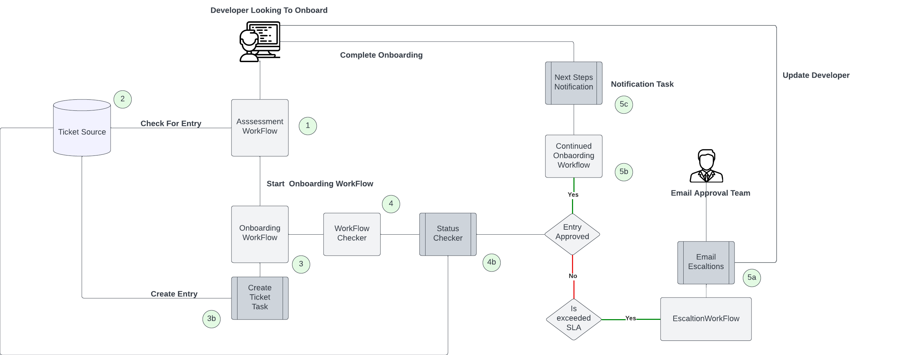
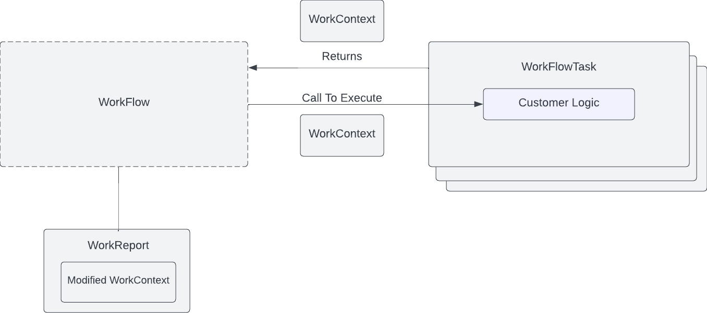
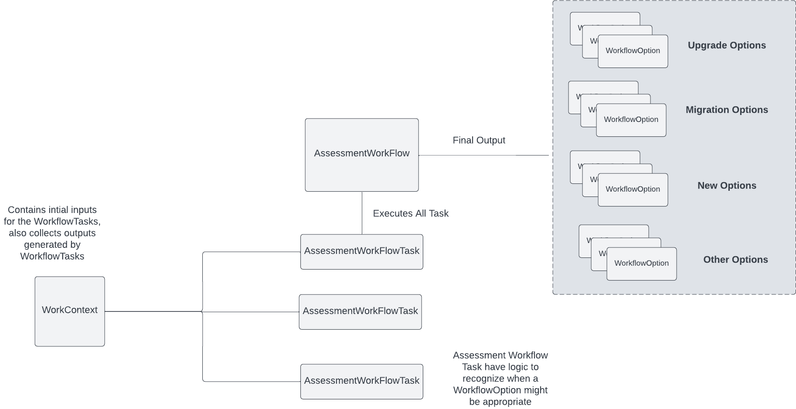

# Parodos Model API

## Introduction

The goal of Parodos is to provide Java based Workflows that blend modern automation tooling with integrations and insight into legacy (and even manual) processes to provide developers everything they need to start quickly and effectively coding and deploying their code in their unique environment.

This project contains all the dependencies to create and configure Parodos Workflows. 

The goal of a Workflow is to achieve an outcome for a developer. For example, the OCP onboarding Workflow might perform all the steps to set up tooling, environment but also permissions, networking and required monitoring and security tooling. After running this Workflow, not only can add developer build, deploy and test in lower level environments, but they also have an easier path to get to production with their code.

Parodos Workflows are composed of Parodos WorkflowTasks. These perform the necessary steps in the Workflow to achieve the desired outcome. How many WorkflowTasks (steps) are required to achieve an outcome will vary across environments.

Parodos Workflows can be executed by the Parodos workflow-service.

This is a high level view of a complete Workflow and WorkflowTasks, running in the workflow-service (this also shows how the notification-service) interacting with a tooling and process in a legacy environment to get a developer set up to work.



The README of the workflow-example folder in this project will provide an overview of what a Parodos Workflow/WorkflowTask configuration can look like.

Developers/Quality Assurance/Application Support and any other member of a software delivery can consume Parodos workflows via a Backstage plugins (https://github.com/janus-idp/backstage-plugins), or using the Parodos backing APIs integrated with another interface developed by the enterprise.

The IDP internal development team build Workflows and their composing WorkflowTasks in partnership with infrastructure operations/networking/audit/security/DevOps (any team in the enterprise owning/operating/governing tools and environment) using this API.

The following is a UML diagram of the current Parodos Object Model.


This document will provide more details around how to use the Parodos model to created Worksflow that can be executed by the Parodos workflow-service.

## Building The Code

The source for this package is in the Parodos repo. Use the **parent** pom.xml at the **root of the project** to build and install it into your local maven repo.

```shell

mvn clean install

```

After a successful build the libraries can be added to a Java project by adding the following to a maven POM file.

```xml

		<dependency>
			<groupId>com.redhat.parodos</groupId>
			<artifactId>parodos-model-api</artifactId>
			<version>${revision}</version>
		</dependency>

```

## Concepts and Example Usage

The foundation of Parodos is the Workflow object (see the workflow-engine folder of this project for more details about Workflows). Workflows are composed of WorkflowTasks. WorkflowTasks do the work of the Workflow. A WorkContext is shared throughout the Workflow's execution. This provides a means of passing information into the Workflow before execution, but also a means of collecting information created during the execution. A WorkReport is returned at the end of an execution for a Workflow that provides an indication of the final outcome of the Workflow and the final state of the WorkContext. Workflows are consumed by the workflow-service where additional functionality around persistence and execution is made available.





In Parodos there are a few specified Workflows that are common in the IDP space.  They can be found in the `WorkFlowType` enum. At present these are:

- Assessment (takes inputs and gives a list of Workflow options for a user to choose from)
- Checker (determines the status of a manual process that is blocking other Workflows from running)
- Infrastructure (creates tooling and environments)

Here is a overview of how an Assessment workflow works.



Executions of the WorkflowTasks (which is done by the Workflow object) can be done in:

- Serial
- Parallel
- Predicate
- Repeating

At present the Parodos Workflow engine wraps the Easy Flows project (https://github.com/j-easy/easy-flows). Future releases of Parodos may provide options to leverage other Workflow engines. For this first version of Parodos, easy-flows provides all the necessary functionality.

The following is a brief overview of the object model.

## Object Overview

The following is a quick description of the important objects and base types in this project. All of these objects are intended to be created (and configured) using Spring beans.

### Parodos WorkflowTask

WorkflowTask objects do work (as defined in the execute method) and are placed in a Workflow object where they will be executed when the Workflow itself is executed. Parodos provides to structure around the types of tasks with some abstract implementations. These are useful implementations for an IDP.

** BaseAssessmentTask ** - these WorkflowTasks accepts a collection of inputs, and returns WorkflowOptions based on custom logic that can be defined in the task. These tasks are intended to be used in Workflows to help developers (and other team members) determine what Workflows they can run for their use case. For example, an assessment might review code looking for a pipeline definition or the presence of a certain 3rd party service - both of which would imply different workflows.

** BaseWorkFlowTask ** - these WorkflowTasks are intended to call downstream systems that initiate automation. The class can optionally reference a WorkflowChecker workflow

** WorkFlowCheckerTask ** - Checks the status of manual processes triggered by other Workflows. WorkFlowCheckerTasks can be long-running when placed into a WorkFlow when the definition of the Workflow it's contained inside the type WorkFlowCheckerDefinition (the workflow-service provides scheduling for these tasks) and its outcomes.

The following is an example of a WorkflowTask being defined.

```java

public class RestAPIWorkFlowTask extends BaseInfrastructureWorkFlowTask {

	private static final String PAYLOAD_PASSED_IN_FROM_SERVICE = "PAYLOAD_PASSED_IN_FROM_SERVICE";

	private String urlDefinedAtTaskCreation;

	public RestAPIWorkFlowTask(String urlDefinedAtTaskCreation) {
		super();
		this.urlDefinedAtTaskCreation = urlDefinedAtTaskCreation;
	}

	/**
	 * Executed by the InfrastructureTask engine as part of the Workflow
	 */
	public WorkReport execute(WorkContext workContext) {
		try {
			String urlString = getParameterValue(workContext, urlDefinedAtTaskCreation);
			String payload = getParameterValue(workContext, PAYLOAD_PASSED_IN_FROM_SERVICE);
			log.info("Running Task REST API Call: urlString: {} payload: {} ", urlString, payload);
			RestTemplate restTemplate = new RestTemplate();
			ResponseEntity<String> result = restTemplate.postForEntity(urlString, payload, String.class);
			if (result.getStatusCode().is2xxSuccessful()) {
				log.info("Rest call completed: {}", result.getBody());
				return new DefaultWorkReport(WorkStatus.COMPLETED, workContext);
			}
			log.error("Call to the API was not successful. Response: {}", result.getStatusCode());
		}
		catch (Exception e) {
			log.error("There was an issue with the REST call: {}", e.getMessage());

		}
		return new DefaultWorkReport(WorkStatus.FAILED, workContext);
	}

	@Override
	public List<WorkFlowTaskParameter> getWorkFlowTaskParameters() {
		return List.of(
				WorkFlowTaskParameter.builder().key(urlDefinedAtTaskCreation)
						.description("The Url of the service (ie: https://httpbin.org/post").optional(false)
						.type(WorkFlowTaskParameterType.URL).build(),
				WorkFlowTaskParameter.builder().key(PAYLOAD_PASSED_IN_FROM_SERVICE)
						.description("Json of what to provide for data. (ie: 'Hello!')").optional(false)
						.type(WorkFlowTaskParameterType.PASSWORD).build());
	}

	public List<WorkFlowTaskOutput> getWorkFlowTaskOutputs() {
		return List.of(WorkFlowTaskOutput.HTTP2XX, WorkFlowTaskOutput.OTHER);
	}

}


```


### Workflow Definitions and Workflow Types

The Parodos model provides some annotations that can be placed on a Bean creating a Workflow object.

There are:

- Assessment
- Checker
- Infrastructure

The annotations provide a means of configuring the Workflow and also indicating to the workflow-service these specific types of Workflows, so it can provide the related functionality for these Workflows (ie: Checker workflows can be scheduled to execute based on a cron expression specific in the Checker annotation).

Here is an example of a Workflow bean being created (and the WorkflowTask it uses), and a Workflow annotation being used:

```java

	@Bean
	MockApprovalWorkFlowCheckerTask approvalChecker() {
		return new MockApprovalWorkFlowCheckerTask();
	}

	@Bean("onboardingWorkFlow" + WorkFlowConstants.CHECKER_WORKFLOW)
	@Checker(nextWorkFlowName = "nameSpaceWorkFlow" + WorkFlowConstants.INFRASTRUCTURE_WORKFLOW,
			cronExpression = "0 0/1 * * * ?")
	WorkFlow onboardingWorkFlowCheckerWorkFlow(@Qualifier("gateTwo") MockApprovalWorkFlowCheckerTask gateTwo) {
		// @formatter:off
		return SequentialFlow.Builder.aNewSequentialFlow()
				.named("onboarding Checker WorkFlow")
				.execute(gateTwo)
				.build();
		// @formatter:on
	}

```

### Describing Workflows To Users

** WorkFlowOption ** - a description of a Workflow that can be presented to a user as a potential Workflow to execute. These can be created using a building method returning a Bean.

```java

	@Bean
	WorkFlowOption onboardingOption() {
		return new WorkFlowOption.Builder("onboardingOption",
				"onboardingWorkFlow" + WorkFlowConstants.INFRASTRUCTURE_WORKFLOW)
						.addToDetails("A Sample of what could be soon to a user").displayName("Start Using Our Awesome Platform")
						.setDescription("An Awesome Collection of tools and environments configured for the team to use").build();
	}

```

** WorkFlowOptions ** - a collection of WorkFlow options grouped in a categories specific to IDP common workflows. These are upgrade, migrate, new (this is onboarding for the first time) and other (these are team related workflows like adding a new developer to a project). WorkflowOptions are created by an AssessmentTask. In a Workflow there might be many of these WorkflowTasks

Here is a sample of a AssessmentTasks.

```java


public class OnboardingAssessmentTask extends BaseAssessmentTask {

	private static final String INPUT = "INPUT";

	public OnboardingAssessmentTask(WorkFlowOption workflowOption) {
		super(List.of(workflowOption));
	}
	

	@Override
	public WorkReport execute(WorkContext workContext) {
		WorkContextDelegate.write(workContext, WorkContextDelegate.ProcessType.WORKFLOW_EXECUTION,
				WorkContextDelegate.Resource.WORKFLOW_OPTIONS,
				// @formatter:off
				new WorkFlowOptions.Builder()
				.addNewOption(getWorkFlowOptions().get(0))
				.build());
				// @formatter:on
		return new DefaultWorkReport(WorkStatus.COMPLETED, workContext);
	}

	public List<WorkFlowTaskParameter> getWorkFlowTaskParameters() {
		return List.of(WorkFlowTaskParameter.builder().key(INPUT)
				.description("Enter some information to use for the Assessment to determine if they can onboard")
				.optional(false).type(WorkFlowTaskParameterType.TEXT).build());
	}

	@Override
	public List<WorkFlowTaskOutput> getWorkFlowTaskOutputs() {
		return Collections.emptyList();
	}

}

```

For a complete example of how to use this API, please refer to the 'workflow-example' project. To learn more about the workflow-service (the Parodos API that executes Workflows and maintains all relevant state), refer to the README of the workflow-service folder.


### Delegates

The model includes some classes that contain useful logic related to creating and running Workflows and WorkflowTasks

** WorkContextDelegate ** - a utility class containing help functions related to working with the WorkContext

This project also specifies definition classes, which are required for versioning and for UI related functionality.


## Using This API with the Workflow Service

Provided all the code was created in following the standards outlined, simply generate a Jar file and place this in the classpath of the Infrastructure Service. Upon start up it will register the configured Task(s) and WorkFlow(s).

Future versions of Parodos will include other options for creating and registering WorkFlowTasks and WorkFlows.

## Demo Implementation

For a full example show how to configure all these Task(s) and WorkFlows(s), please refer to the 'workflow-examples'.