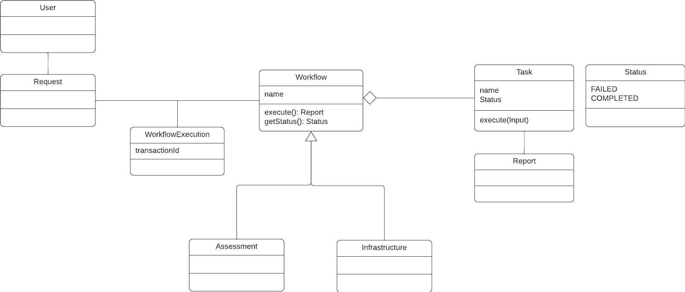

# Parodos Model API

This project contains all the dependencies to externally create and configure:

- InfrastructureOption(s)
- BaseWorkFlowTask(s)

The following is a UML diagram of the Object Model.



# Adding The Client Library To A Project

```xml

	<dependency>
		<groupId>com.redhat.parodos.workflow</groupId>
		<artifactId>workflow-engine</artifactId>
		<version>${parodos.version}</version>
	</dependency>

```

The source for this package is in the Parodos repo. Use the parent pom.xml at the root of the project to build and install it into your local maven repo.

```shell

mvn clean install

```

# Concepts and Example Usage

The following outlines how to create the key constructs required for the InfrastructureService to power the Parodos UI to streamline the process of getting infrastructure for a code base

The following Beans will need to be created to configure the Infrastructure Service:

- InfraStructureOption(s)
- AssessmentTask(s)
- AssessmentWorkflow(s)
- InfrastructureTask(s)
- InfrastrcutureWorkflow(s)

# InfrastructureOptions(s)

InfrastructureOption(s) provide a name and metadata to group together a service of InfrastrcutureEvent(s) that will be executed should a user wish to request the creation of an InfrastructureOption. And example of the infrastructureOption might be to:

- request for Jenkins, Artifactory, Sonar Cube and Argo to be provisioned
- inject a pipeline into a Github repo to use the tools being provisioned
- create AD groups to access the tools for the team
- create all environments (DEV, QA, UAT) for the tool chain to deploy too

## Creating InfrastructureOptions

The following is an example of creating an InfrastrastructureOption for consumption from the BeanWorkflowRegistryImpl that ships with the current version of the Infrastructure Service. For other alternative ways of loading the Infrastructure Service domain, see the WorkFlowRegistry interface in the Infrastructure Service

Note: All examples in this document will be based on usage of the Infrastructure Service with the BeanWorkflowRegistryImpl. Future release of the service will provide alternative ways to configure WorkFlows and InfrastructureOption(s)

```java

	@Bean(name = "awesomeToolStack")
	InfrastructureOption awesomeToolStack() {
		return new InfrastructureOption
				.Builder("Awesome Tool Stack With Correct Permissions And Config", "awesomeToolStackWorkFlow" + WorkFlowConstants.INFRASTRUCTURE_WORKFLOW)
				.displayName("Managed Environment")
				.addToDetails("Charge Back: .30/hr")
				.addToDetails("Team must supply their own logging solution")
				.addToDetails("SLA: 99.999 (based on Azure's SLA)")
				.addToDetails("24/7 support with a 2 hour response time")
				.addToDetails("After developing with these tools for 1 hour you will feel better about your life")
				.setDescription("Managed Environment complete with CI/CD and configured Pipelines").build();
	}

```


## AssessmentTask(s)

The goal of an AssessmentTask is to determine if a Workload (ie: code base or config) has InfrastructureOptions it can be upgraded and/or migration too or if there is an option to create a brand new set of tools and environments.


### Creating AssessmentTask(s)

The following is a basic AssessmentTask (for BeanWorkflowRegistryImpl consumption). It takes a simple input and returns a list of InfrastructureOption to be displayed in the Parodos UI for a User to choose from.

```java

public class SimpleAssessment implements BaseWorkFlowTask {
	
	//We only have one InfrastructureOption to recommend - but this could also be a list or a Map of Options
	private final InfrastructureOption myOption;
	
	public SimpleAssessment(InfrastructureOption myOption) {
		this.myOption = myOption;
	}

	//This will return the same InfrastructureOptions
	public WorkReport execute(WorkContext workContext) {
		log.info("This is my assessment - it always recommends the InfrastructureOption 'Awesome Tool Stack With Correct Permissions And Config'");
		log.info("Putting the recommended InfrastructureOption in the InfrastructureOptions wrapper and placing it in the WorkContext");
		workContext.put(WorkFlowConstants.RESULTING_INFRASTRUCTURE_OPTIONS, 
				new InfrastructureOptions.Builder()
				.addNewOption(myOption)
				.build());
		return new DefaultWorkReport(WorkStatus.COMPLETED, workContext);
	}

	//Supply the a parameter to describe what is needed for this workflow, but also for the UI to render a control to capture it
	@Override
	public List<WorkFlowTaskParameter> getWorkFlowTaskParameters() {
		return List.of(WorkFlowTaskParameter.builder().key("DOG_NAME").description("String value with the name of a cool dog").build());
	}
	
}

```

AssessmentTask(s) need to be packaged as a Workflow for the Infrastructure Service to consume them. Here is an example of such a configuration for BeanWorkflowRegistryImpl consumption


### Creating An AssessmentWorkflow

The following is an example of combining the previous AssessmentTask into a Workflow that the can be registered by the BeanWorkflowRegistryImpl in the Infrastructure Service and then triggered from the Assessment endpoints

```java

@Configuration
public class AssessmentConfig  {
	
	//There might be many AssessmentTasks, using names and qualifiers ensure the right assessments under up in the correct workflow
	@Bean(name= "simpleAssessment")
	BaseWorkFlowTask simpleAssessment(@Qualifier("awesomeToolStack") InfrastructureOption awesomeToolsOption) {
		return new SimpleAssessment(awesomeToolsOption);
	}

	//There might be many AssessmentTasks, using names and qualifiers ensure the right assessments under up in the correct workflow
	@Bean(name="assessmentWorkFlow" + WorkFlowConstants.ASSESSMENT_WORKFLOW)
	WorkFlow assessmentWorkFlow(@Qualifier("simpleAssessment") BaseWorkFlowTask simpleAssessment) {
		return SequentialFlow
				.Builder
				.aNewSequentialFlow()
				.named("MyAssessment_" + WorkFlowConstants.ASSESSMENT_WORKFLOW)
				.execute(simpleAssessment)
				.build();
	}
	
}


```

This WorkFlow will run the Task previously defined.

## InfrastructureEvent(s)

These tasks are essentially Callable/Runnable Java logic to call back-end systems in the enterprise to provisioning the tooling/environments described in the InfrastructureOption(s). InfrastructureEvent(s) will have the context captured from the Assessment along with the information obtained through the User interacting with the Parodos UI to utilize in their logic.

### Creating InfrastructureEvent(s)

The following is an infrastructure event to make a call to an API while passing a payload with information obtained from the AssessmentWorkflow and the UI

```java

public class CallCustomRestAPITask implements BaseWorkFlowTask {

    static public final String PAYLOAD_PASSED_IN_FROM_SERVICE = "PAYLOAD_PASSED_IN_FROM_SERVICE";
    static public final String URL_PASSED_IN_FROM_SERVICE = "URL_PASSED_IN_FROM_SERVICE";

    /**
     * Executed by the InfrastructureTask engine as part of the Workflow
     */
    public WorkReport execute(WorkContext workContext) {
        try {
            String urlString = getValueFromRequestParams(workContext, URL_PASSED_IN_FROM_SERVICE);
            String payload = getValueFromRequestParams(workContext, PAYLOAD_PASSED_IN_FROM_SERVICE);
            log.info("Running Task REST API Call: urlString: {} payload: {} ", urlString, payload);
            RestTemplate restTemplate = new RestTemplate();
            ResponseEntity<String> result = restTemplate.postForEntity(urlString, payload, String.class);
            if (result.getStatusCode().is2xxSuccessful()) {
                log.info("Rest call completed: {}", result.getBody());
                return new DefaultWorkReport(WorkStatus.COMPLETED, workContext);
            }
            log.error("Call to the API was not successful. Response: {}", result.getStatusCode());
        } catch (Exception e) {
            log.error("There was an issue with the REST call: {}", e.getMessage());

        }
        return new DefaultWorkReport(WorkStatus.FAILED, workContext);
    }

    private String getValueFromRequestParams(WorkContext workContext, String key) throws MissingParameterException {
        if (workContext.get(key) == null) {
            throw new MissingParameterException("For this task the WorkContext required key: " + key + " and a coresponding value");
        }
        return (String) workContext.get(key);
    }

    @Override
    public List<WorkFlowTaskParameter> getWorkFlowTaskParameters() {
        return List.of(
				WorkFlowTaskParameter.builder()
						.key(URL_PASSED_IN_FROM_SERVICE)
						.description("The Url of the service (ie: https://httpbin.org/post")
						.optional(false)
						.type(WorkFlowTaskParameterType.URL)
						.build(),
				WorkFlowTaskParameter.builder()
						.key(PAYLOAD_PASSED_IN_FROM_SERVICE)
						.description("Json of what to provide for data. (ie: 'Hello!')")
						.optional(false)
						.type(WorkFlowTaskParameterType.PASSWORD)
						.build());
    }
}


```

Similar Tasks can be created. A tip on creating such Task; __Avoid overly complex logic. These tasks are intended for making API calls, posting messages on Queues and/or executing existing scripts where the true logic to create InfrastructureOption(s) resides__.


## InfrastructureTaskWorkflow

InfrastructureEventWorkflow(s) determine which InfrastructureEvent(s) should execute and the order execution should occur.

### Creating An InfrastructureTaskWorkflow

The following is an example of an InfrastructureTaskWorFlow (that can  be registered by the BeanWorkflowRegistryImpl) that combines multiple InfrasrtuctureTasks into a single executable unit

```java

@Configuration
public class InfrastructureConfig {

	// There will be lots of beans of InfrastructureOption types - names and
	// qualifiers will make sure the right tasks are put into the workflow
	@Bean(name = "awesomeToolStack")
	InfrastructureOption awesomeToolStack() {
		return new InfrastructureOption
				.Builder("Awesome Tool Stack With Correct Permissions And Config", "awesomeToolStackWorkFlow" + WorkFlowConstants.INFRASTRUCTURE_WORKFLOW)
				.displayName("Managed Environment")
				.addToDetails("Charge Back: .30/hr")
				.addToDetails("Team must supply their own logging solution")
				.addToDetails("SLA: 99.999 (based on Azure's SLA)")
				.addToDetails("24/7 support with a 2 hour response time")
				.addToDetails("After developing with these tools for 1 hour you will feel better about your life")
				.setDescription("Managed Environment complete with CI/CD and configured Pipelines").build();
	}

	// There will be lots of beans of InfrastructureTask type - names and qualifiers
	// will make sure the right tasks are put into the workflow
	@Bean(name = "restApiTask")
	CallCustomRestAPITask restApiTask() {
		return new CallCustomRestAPITask();
	}

	// There will be lots of beans of InfrastructureTask type - names and qualifiers
	// will make sure the right tasks are put into the workflow
	@Bean(name = "anotherTask")
	AnotherTask anotherTask() {
		return new AnotherTask();
	}

	// There will be lots of beans of InfrastructureTask type - names and qualifiers
	// will make sure the right tasks are put into the workflow
	@Bean(name= "awesomeToolStackWorkFlow" +  WorkFlowConstants.INFRASTRUCTURE_WORKFLOW)
	WorkFlow superAwesomeTechnologyStackWorkflow(@Qualifier("restApiTask") CallCustomRestAPITask restApiTask, @Qualifier("anotherTask") AnotherTask anotherTask) {
		return SequentialFlow.Builder.aNewSequentialFlow()
				.named("AwesomeToolsAndEnvironment_" +  WorkFlowConstants.INFRASTRUCTURE_WORKFLOW)
				.execute(restApiTask)
				.then(anotherTask)
				.build();
	}
}

```

## Registering the Customizations With The Infrastructure Service For BeanWorkflowRegistryImpl Consumption

Provided all the code was created in accordance with the above examples, simply generate a Jar file and place this in the classpath of the Infrastructure Service. Upon start up it will register the configured Task(s) and WorkFlow(s).

Future versions of Parodos will include other options for creating and registering WorkFlowTasks and WorkFlows

## Demo Implementation

For a full example show how to configure all these Task(s) and WorkFlows(s), please refer to the 'workflow-examples'

# Authors

Luke Shannon (Github: lshannnon)