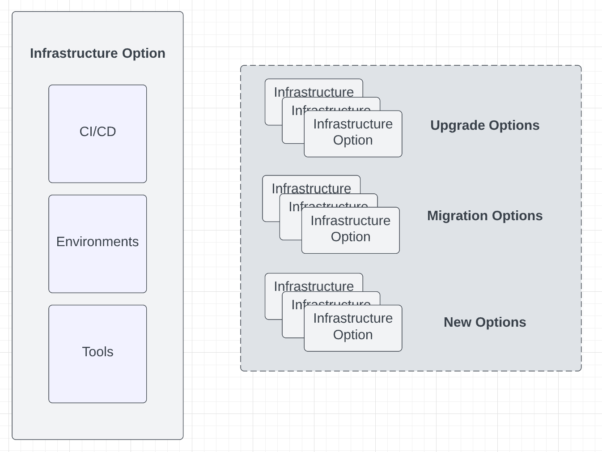
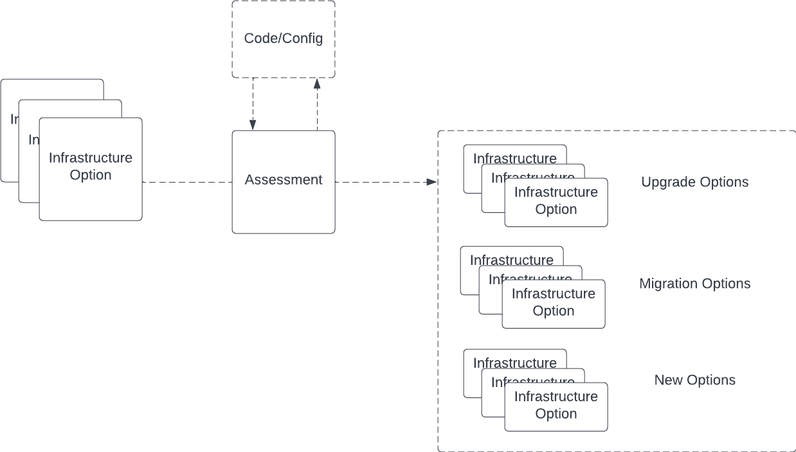
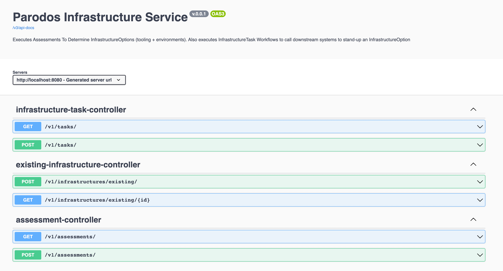

# Parodos Infrastructure Service

This service is designed to call existing automation and tools to help get developers what they need to begin coding. This service is not intended to replace automation frameworks or complex business rules engines that already exist in enterprise environments looking to run a Parodos based Developer Portal.

## Domain Model

The following a review of the main domain objects used by the Infrastructure review. Some Dto and aggregated objects are omitted from this review for brevity. The Java Docs for this classes should provide adequate explanation for who they are used. 

**InfrastructureOption(s)**

Represent stacks of tooling, environments and permissions that a developer would need to begin coding for a specific type of application



**AssessmentTask(s)**

Work units that review a code base/configuration and return applicable InfraStructionOptions for a developer to choose from to put their application on (this might be a new InfrastructionOption), upgrade too (improvements to the InfrastructureOption an application is already running on) or migrate too (move the application to a different InfrafrastureOption that already exists)



**AssessmentWorkFlow(s)**

Sequence of AssessmentTask(s) to execute. The resulting InfrastructureOptions is the culmination of all the AssessmentTasks

**InfrastructureEvent**

Unit of Work that calls an existing process in the enterprise to create a tool, update a permission, create/configure an environment that is required for an InfrastructureOption


**InfrastructureEventWorkFlow(s)**

Sequence of InfrastructureEvent(s) that are executed to create an InfrastructureOption. These workflows can also be created to 'rollback' an InfrastructureEventWorkFlow that might have failed to successfully complete


**ExistingInfrastructureEntity**

A reference created after the execution of the an InfrastructureEventWorkFlow. It can be used to track the 'state' of the InfrastructureOption. This is a JPA persisted entity. Note: These references cannot be deleted. They can have their status changed to indicate being 'cancelled' if the InfrastructureOption is not longer being managed through Parodos. See InfrastructureTaskStatus for the different states that are available out of the box.

The domain mode can be located in the 'parodos-model-api' folder, with the exception of the ExistingInfrastructureEntity (this only exists in the Infrastructure Service application). Keeping the domain model seperate from the application is useful for those that wish to build their InfrastructureWorkFlows as separate Jars. More details on configuring WorkFlows can be found later in this document.

## Service Endpoints

The Infrastructure Service provides the following endpoints:

**Infrastructure**
- GET /v1/tasks - Gets a list of all 'id' the InfrastructureWorkFlows available for execution
- POST /v1/tasks - Allows for the execution of an InfrastructureWorkFlow

**Assessment**
- GET /v1/assessments - Gets a list of all the 'id' of Assessment WorkFlows available for execution
- POST /v1/assessments - Allows for the execution of an Assessment WorkFlow, returns an InfrastuctureOptions reference (this a collection of InfrastructureOption(s) grouped in a way that the Parodos Infrastructure UI can consume them)

**Existing Infrastructure**
- GET /v1/infrastructures/existing/{id} - Returns a Dto object containing the data from the ExistingInfrastructureEntity corresponding to the passed in id
- POST /v1/infrastructures/existing - The body of the request must contain a TaskExecutionLogDto. This is a simple Dto to add a eventLog entry to the ExistingInfrastructureEntity

## Loading WorkFlows into the Application

The Infrastructure Service is designed to load the WorkFlows for Assessment and InfrastructureEvent using an implementation of WorkFlowRegistry. Implementations of this class will determine how the an instance of Infrastructure Service gains access to configured WorkFlows and makes them available to the different Services and Endpoints in the application

```java

public interface WorkFlowRegistry<T> {
	
    Set<T> getRegisteredWorkFlowNames();
    
    Map<T,WorkFlow> getAllRegisteredWorkFlows();
    
    WorkFlow getWorkFlowById(T id);
    
    Collection<T> getRegisteredWorkFlowNamesByWorkType(String typeName);
}

```

The current default Implementation is a BeanWorkflowRegistryImpl. This will load all Spring Beans of type: com.redhat.parodos.workflows.workflow.WorkFlow into the registry which will in turn make them available for their respective Services. BeanWorkflowRegistryImpl filters WorkFlows based on the Bean 'name' attribute. Appending the value of AssessmentWorkFlowAware.ASSESSMENT_WORKFLOW and InfrastructureTaskAware.INFRASTRUCTURE_TASK_WORKFLOW to the respective Assessment and InfrastructureTask WorkFlow Bean name will allow for the BeanWorkflowRegistryImpl to effectively differentiate between Workflows that are Assessment vs. InfrastructureTask. See the simple-workflow-example-infrastructure-service project for an example of how this is done


## Configuring WorkFlows In The Infrastructure Service

Using the BeanWorkflowRegistryImpl Tasks and WorkFlows can be created using @Bean and @Configuration annotations of the Spring Framework. This can be done as part of the Infrastructure Service's code base, or in a seperate Jar that can add to the class path of the Infrastructure Service.

Future implementations of WorkFlowRegistry may support storing of Tasks and WorkFlows in external files or a Database

The following is a review of how Tasks and WorkFlows are configured and executed using an External Jar.


## Testing The Infrastructure Service Locally

Running the Infrastructure Service using the Spring Profile 'local' will start the application with security disabled. DO NOT RUN THIS PROFILE IN PRODUCTION.

```shell

java -jar target/infrastructure-service-0.0.1-SNAPSHOT.jar -Dspring.profiles.active=local

```
After starting the Swagger Endpoint can be accessed with the following URL: http://localhost:8080/swagger-ui/index.html



Ensure the dependency for simple-workflow-example-infrastructure-service is in the Infrastructure Service's classpath prior to building the application for testing. This will provide some Tasks and Workflows for the Swagger Endpoints to work with

## FAQ

### Why doesn't the service use a more mature/feature rich Business Rules engine?

It is assumed that Parodos will be running in enterprise environments where there will be many tools and platforms available. As a result Parodos has not interest in trying to compete with such tools. The approach is to send the appropriate data to these existing tools, and the most appropriate time to allow for them to be more effectively used and integrated with other tools.

### These workflows are not advanced enough for me to provision the Infrastructure Options. Will more automation features be added to Parodos?

If you are finding Parodos's simple InfrastructureTask workflows not advanced enough to manage the creation and configuration of your tools you are not using Parodos in its intended purpose. Automation tools such as Ansible or Terraform should be used to manage the creation and update of infrastructure. Tools such as Jira Service desk and should manage permission workflows. Think of Parodos as a way to tie these disparate systems together for a more comprehensive experience for consumers of the tools. If you are lacking such automation and tools, it might not be the right time for you to use Parodos

### Will there be support to configure rules beyond Spring Beans?

Yes. In this first release a configuration pattern widely used across many enterprise environments was chosen. However future release will include a DSL (domain specific language) for configuring WorkFlows without have to write Java code.

### Is there a way to keep track of what WorkFlows have executed and their state of execution?

Outside of the ExistingInfrastructureEntity, which is more for updating the Parodos UI, Parodos includes a Project History service. This is a robust and persistent REST API for tracking the Tasks, Events and State of Projects being managed through Parodos. This API will be release very soon


