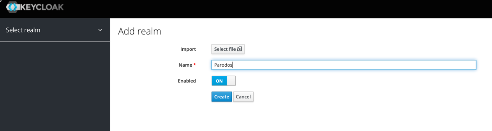
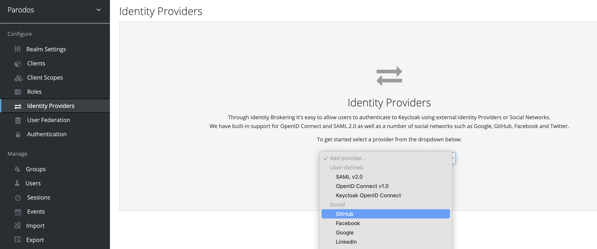

# Parodos Backstage Configuration

**NOTE:** As the Parodos backend services have not been added to the project yet, the workflows in these plugins will not be functional. We will be checking these backend services in shortly

The user interfaces for the Parodos workflows can be ran as Backstage plugins. Using Backstage provides an excellent means of transitioning between Parodos workflows creating a seamless client experience while consuming Parodos workflows.

The following is a high level summary of the Parodos and Backstage integration:


The following outlines this integration in detail.

To learn more about Backstage.io, please refer to their documentation:
https://backstage.io/docs/overview/what-is-backstage

## Running Locally

In this directory is a Backstage distribution configured to run the Parodos workflows as Plugins.

**_Note:_** This is an older version of Backstage. Efforts will be made to update it at a later time

To get started with Backstage refer to the project Prerequisite : https://backstage.io/docs/getting-started/#prerequisites

Running the Parodos Configurered Stage requires Keyclock to be running locally and configured. To install Keycloak locally run the following commands:

```sh

docker run -p 3434:8080 --name keycloak  -d -e KEYCLOAK_ADMIN=admin -e KEYCLOAK_ADMIN_PASSWORD=admin quay.io/keycloak/keycloak:17.0.1 start-dev
docker start keycloak

```

You can check if the docker image is in place with this command:

```sh

docker image list | grep keycloak

```

The result should look something like this:

```sh

quay.io/keycloak/keycloak                17.0.1           8cd848839dcc   7 months ago   578MB

```

Once Keycloak is running locally, the following steps will configure it to use Github at Indentity provider for the Parodos configured Backstage authenticate with.

### Keycloak Configuration

GitHub is used as the identity provider of KeyCloak in the Parodos demo. To configure KeyCloak for integration with that Parodos configured Backstage, please follow these steps:

1. Log into Keycloak. Locally it will be http://localhost:3434. Click the link that says Administrative Console on the landing page. In the login form put the following credenditals; username:admin, password: admin
2. Hover over term 'Master' in the upper left. A dropdown will appear to 'Add Realm'. Click on that option <br/> 
3. Fill out the details on the new realm by providing a name (in this case Parodos) 
4. Go to the identity provider of the realm and create 'github' indendity provider 
5. Copy the redirect URI 
6. In GitHub, go to Settings/Developer settings and click "new OAuth app", and paste the value from step 4 (http://localhody:3434/realms/Parodos) to "Authorization callback URL", then paste the same value in "Homepage URL" and cut "/broker/github/endpoint" at the end (http://localhost:3434/realms/Parodos/broker/github/endpoint)
7. In Github/Settings/Developer click "Register Application" 
8. In Github/Settings/Developer click "Generate a new client secret" and copy the value (do not close or refresh this page as the secret will not be viewable again) 
9. Go back to Keycloak and add the "Client Secret" and "Client Id" from Github, then save
10. Go to Keycloak/Clients and create a new Client 
11. Add the redirect Urls (http://localhost:9000, http://localhost:9000/, http://localhost:9000/\*, https://github.com/logout) and Web Origins (http://localhost:9000) 
12. Go to Keycloak Authentication and click "Config" in the dropdown of Actions on line of "Identity Provider Redirector" 
13. Fill in the name of the identity provider for github, then save 

The Parodos realm and client is configured in [keycloak config](./packages/app/src/components/Root/Root.tsx?#L149-L150)

```javascript
...
    let initOptions = {
      url: keycloakUrl,
      realm: '****',
      clientId: '****',
    };
...
```

To run this Backstage install locally, execute the following commands:

Notes:

- 'yarn install' will take about 21 seconds. Even if there are errors, wait for the following message ✨ Done in 21.24s.
- 'yarn tsc || true' will generate some errors, this is expected
- local-demo.sh is a script that sets all the required environment variables for this configuration of Backstage to start

```sh

nvm use 14
yarn install
yarn tsc || true
source local-demo.sh
yarn build
yarn dev

```

**_Note:_** These directions do not include the Backend services. This steps will be coming soon

## Building The Docker Image

To run the Parodos Configured Backstage an image will need to be generated.

**_Note:_** Anytime a plugin is changed, or configuration file updated the Backstage image will need to be recreated. This is an obvious limitation once the application is in production with users consuming multiple workflows, however it is a limitation of Backstage itself and not something that can address by Parodos

To generate the image, run the following command

```shell

docker image build . -f packages/backend/Dockerfile --tag backstage
docker run -it -p 9000:9000 -p 7007:7007 backstage

```

### Parodos Plugins

The Parodos configured backstage runs 5 Parodos plugins:

- Infrastructure
- Project View
- Notification
- Deploy
- Training

Each of these plugins is a relatively independent React application which has its own package.json, theme, context state and sub routes. The source of each plugin can be found in parodos-configured-backstage/plugins. For descriptions of what each of these workflows do, please refer to the main page of the Parodos project.

The following is a description of the Backstage customizations done to support these plugins.

### Authentication

Parodos uses Keycloak (https://www.keycloak.org/) as its Authentication provider. The provides Parodos a convient way to integrate with existing indentity providers and have a common pattern for validated authentication sessions across Parodos's components.

For more details on Keycloak:
https://www.keycloak.org/guides#getting-started

How Backstage is configured to use Keycloak explained in the following sections.

### Root App

Root App is a React Application running within the parodos-configured-backstage/packages/app folder of Backstage that intergrates the Parodos plugins and customizes Backstage for Parodos.

The Root App (path: parodos-configured-backstage/packages/app/src) contains:

- Navigation bar & Side bar
- UI Theme
- KeyCloak Authentication

All Plugins Routes are registered in Root UI App.tsx and referred in Navigation Bar & Side Bar for routing purpose.

- plugin backends (Parodos plugins do not need any DB connection or any backend services, so this aspect is not required)

#### app-config.yaml

In parodos-configured-backstage/app-config.yaml the routing is configured for the plugins as well as Keycloak (authentication)

```yaml
app:
  title: Parodos
  baseUrl: ${APP_URL}
  support:
    url: ${APP_URL}
    items:
      - title: keycloak
        links:
          - url: ${KEYCLOAK_URL}
      - title: notification
        links:
          - url: ${NOTIFICATION_URL}
      - title: deploy
        links:
          - url: ${DEPLOY_URL}
      - title: infrastructure
        links:
          - url: ${INFRASTRUCTURE_URL}
      - title: event
        links:
          - url: ${EVENT_URL}
```

1. ${APP_URL} is the host url of this backstage app
2. ${KEYCLOAK_URL} is the host url of Keycloak for the authentication
3. Other entries, such as ${DEPLOY_URL}, are the routes to Parodos backend services

These values will be determined based on how these components are deploy. An example of the above configuration can be found in ./local-demo.sh

## Authors

Richard Wang (ricwang@redhat.com)

Luke Shannon (lshannon@redhat.com)
