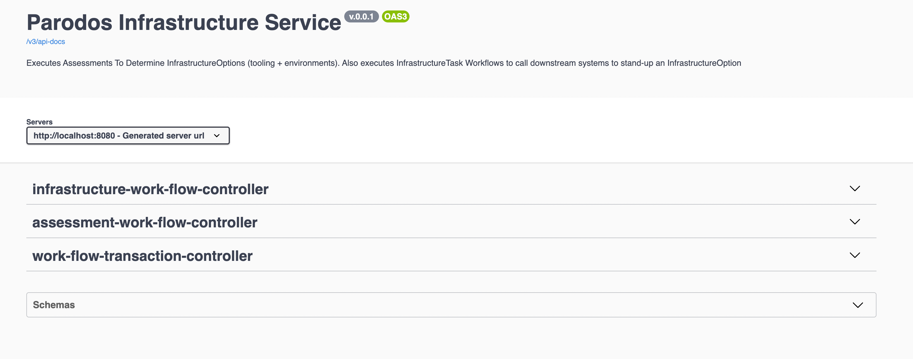
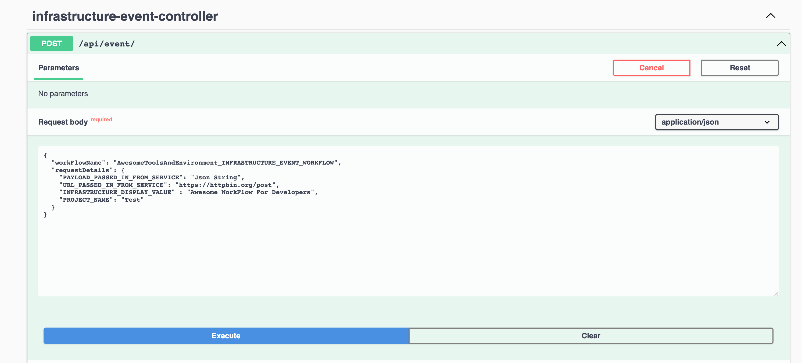
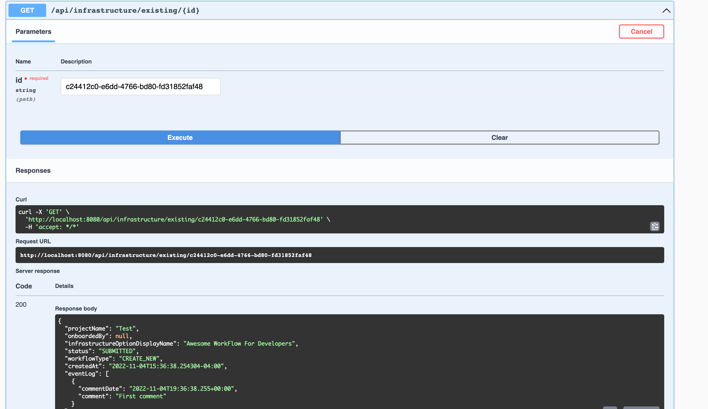
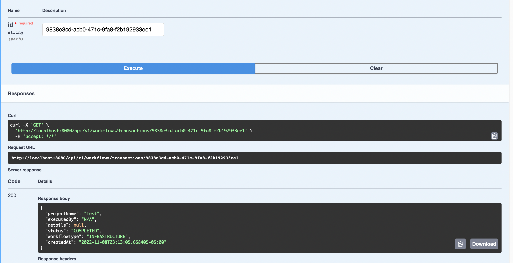
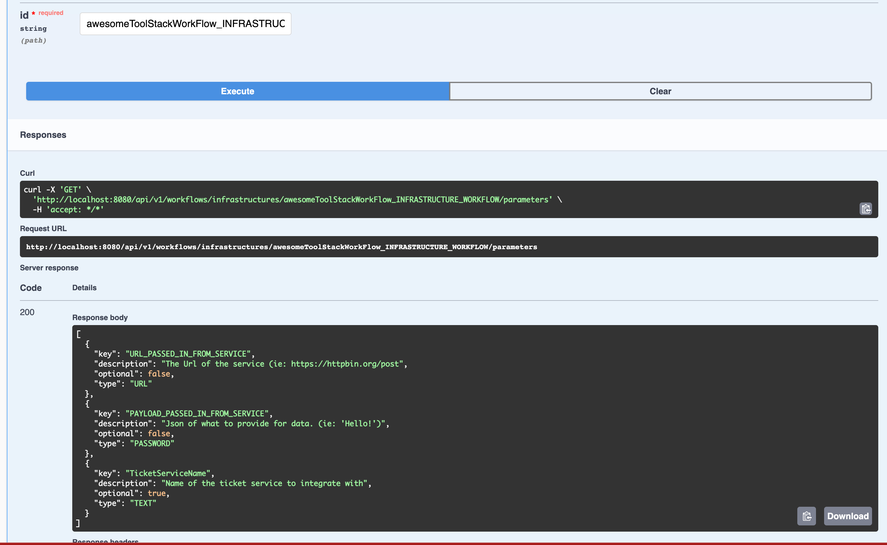

# Simple Example Of Infrastructure WorkFlow Configuration

This project is a very basic example of how to configure an Assessment and InfrastructureTaskWorkFlow for the Parodos Infrastructure Service. Its basically a 'Hello World'. Looks for more complex examples soon.

Its recommended that you read the README for the 'parodos-model-api' and the 'infrastructure-service' prior to working with this sample.

## Using This Sample

The following is a review of how Assessment and Infrastructure WorkFlows can be configured within their own Jar for consumption by the BeanWorkflowRegistryImpl contained in the Infrastructure Service. *Note*: Future versions of the Infrastructure Service will include means of registering Tasks and WorkFlows that are not dependent on the Spring Framework and/or rebuilding the application.

### Compiling The Code

To get the Parodos dependencies you will need to run a maven install from the root of the project folder. This will build all the Java dependencies.

```shell

mvn install

```

### Adding The simple-workflow-example-infrastructure-service To The InfraStructure Service

Once the Jar has been compiled, ensure its added to the pom.xml of the InfraStructure Service. This will allow the BeanWorkflowRegistryImpl to register the Tasks and WorkFlows. 


```xml

	<dependency>
		 <groupId>com.redhat.parodos</groupId>
		 <artifactId>simple-workflow-example-infrastructure-service</artifactId>
		 <version>${parodos.version}</version>
	</dependency>

```
Compiled the application by running the following in the 'infrastructure-service' folder.

```shell

mvn install

```
Then start it by running the following. This will start the application in 'local' mode. This profile is intended for local use. DO NOT ENABLE THIS PROFILE IN PRODUCTION. Starting in any other profile will enable security and integrate it with Keycloak for authentication.


### Testing The Application With The simple-workflow-example-infrastructure-service WorkFlows

After starting the Swagger Endpoint can be accessed with the following URL: http://localhost:8080/swagger-ui/index.html



To run the InfrastructureTaskWorkFlow registered, post the following JSON into the POST: '/api/v1/workflows/infrastructures/' endpoint.

```json

{
  "workFlowParameters": {
    "PAYLOAD_PASSED_IN_FROM_SERVICE": "Json String",
    "URL_PASSED_IN_FROM_SERVICE": "https://httpbin.org/post",
    "WORKFLOW_TYPE" : "INFRASTRUCTURE",
    "PROJECT_NAME": "Test"
  },
  "workFlowId": "awesomeToolStackWorkFlow_INFRASTRUCTURE_WORKFLOW"
}

```
The call will return a HTTP 201 and supply a location on how to obtain the a WorkFlowTransaction record.



To view the WorkFlowTransaction (persisted to an in-memory H2 DB) post the Id created in the previous step into 'api/v1/workflows/transactions/'



The result will show the WorkFlowTransaction reference created



The Assessment WorkFlow is similar in the way its executed. Before executing any WorkFlow the required Parameters to run it can be viewing the 'api/v1/workflows/infrastructures/{id}/parameters' endpoint.




## How To Create A Project Like This

A project similar to this one can be created using Maven. *Note:* Gradle steps can be added to this documentation on demand

### Dependencies

Assuming Maven is your build tool of choice, the following dependencies and versions are required to configure a WorkFlows project. *Note:* Due to Parodos's target market of larger enterprise environments, Java 11 was chosen over the current LTS version (17) and the version most likey to be available. All other dependencies where built around this choice

```xml

	 <properties>
		<project.build.sourceEncoding>UTF-8</project.build.sourceEncoding>
		<java.version>11</java.version>
		<parodos.version>0.0.1-SNAPSHOT</parodos.version>
		<spring.framework.version>5.3.10</spring.framework.version>
		<maven-release-plugin.version>2.5.3</maven-release-plugin.version>
        	<maven-compiler-plugin.version>3.8.1</maven-compiler-plugin.version>
        	<maven-surefire-plugin.version>2.22.2</maven-surefire-plugin.version>
	</properties>

	<dependencies>
		<dependency>
			<groupId>org.springframework</groupId>
			<artifactId>spring-context</artifactId>
			<version>${spring.framework.version}</version>
		</dependency>
		<dependency>
		    <groupId>org.springframework</groupId>
		    <artifactId>spring-web</artifactId>
		    <version>${spring.framework.version}</version>
		</dependency>
		 <dependency>
			<groupId>com.redhat.parodos</groupId>
			<artifactId>workflow-engine</artifactId>
			<version>${parodos.version}</version>
		</dependency>
		<dependency>
			<groupId>com.redhat.parodos</groupId>
			<artifactId>parodos-model-api</artifactId>
			<version>${parodos.version}</version>
		</dependency>
	</dependencies>

```

To get the Parodos dependencies you will need to run a maven install from the root of the project folder. This will build all the Java dependencies.

```shell

mvn install

```

### Package Structures and InfraStructure Service's BeanWorkFlowRegistryImpl

If you are using the out of the box BeanWorkFlowRegistryImpl in the infrastructure service, ensure your packages have the base of 'com.redhat.parodos'. If a different structure is used 'com.mycompany.parodos', any WorkFlows and Tasks defined will not be detected by the BeanWorkFlowRegistryImpl.

### A Word On Dependencies

Please review the dependencies included in the infrastructure service and ensure when creating Tasks and WorkFlows in an external Jar (such as outlined in this project) that dependencies are not included that override existing dependencies that the Infrastructure Service has.

## Tips On Task and WorkFlow Complexity

If you find yourself creating over complex Tasks and WorkFlow, you are not using Parodos for its intended use case. Parodos is intended to tie together existing logic and tools. Tasks and WorkFlows should be posting messages on queues, calling APIs and other light weight integrations.

# Authors

Luke Shannon (Github: lshannon)

