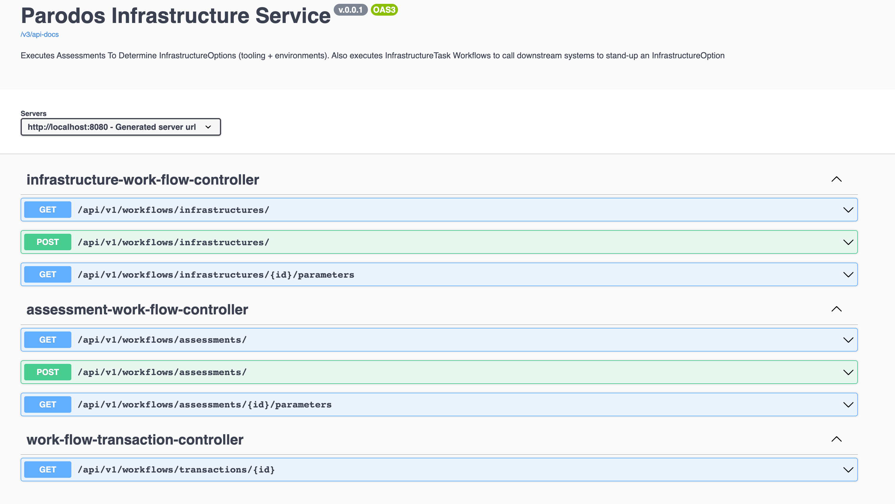

# Parodos Workflow Service

This service is designed run Parodos Workflows (composed of Parodos WorkflowTasks) created using the Parodos Model API.

## Starting The Service Locally

To compile all the components required for this project to work run the maven parent pom in the root directory of the service folder.

```shell

mvn clean package

```

Note: It is assumed 'mvn install' has already been executed at the root level of the project to generate the WorkEngine dependencies into your local maven repository. If this has not been completed the workflow-service will not compile.

The 'workflow-examples' dependency can be found in the pom.xml of the workflow-service. This is a demo configuration to test the service. It should be removed once actual Tasks and WorkFlows start getting created.

To start the application run the following from the root folder of 'workflow-service'.

```shell

java -Dspring.profiles.active=local -jar target/workflow-service-0.0.1-SNAPSHOT.jar

```

For convience there is a shell script at the root of the folder that will run this command as well (start_workflow_service.sh).

The 'local' is intended for local testing and runs the application without security (Keycloak managed Oauth2 flow is the default). Documentation is currently being produced for production grade security configurations.

## Defining Workflows And WorkFlowTasks

More detail on this subject will be covered in the 'parodos-model-api' folder of this project. For a complete example please review 'workflow-example'.

In this present release teams are encouraged to think of Workflows and WorkflowTasks as stand alone Java projects. As such they should have test coverage, undergo a full software release cycle and should not be updated in production trivally. Due to the persistance of both workflow definitions and WorkflowTask executions, the workflow-service can be restarted to update the definition of Workflows and WorkflowTasks.

**Note:** Future release of this service will include WorkFlowTask/WorkFlow creation/configuration options that do not require having to write Java code.

## Loading WorkFlows into the Application

The Workflow Service is designed out-of-the-box to detect and load the WorkFlows using an implementation of WorkFlowRegistry.

```java

public interface WorkFlowRegistry<T> {
	
    Set<T> getRegisteredWorkFlowNames();
    
    Map<T,WorkFlow> getAllRegisteredWorkFlows();
    
    WorkFlow getWorkFlowById(T id);
    
    Collection<T> getRegisteredWorkFlowNamesByWorkType(String typeName);
}

```

The BeanWorkflowRegistryImpl will load all Spring Beans of type: com.redhat.parodos.workflows.workflow.WorkFlow into the registry which will in turn make them available for their respective Services (they must be in the package 'com.redhat.parodos' to be detected). WorkflowTasks and Workflows can be created using @Bean and @Configuration annotations of the Spring Framework. 

This can be done as part of the workflow-service's code base, or in a separate Jar that can add to the class path of the workflow-service. 

Please review the Parodos project 'workflow-examples' for more details.

## Service Endpoint Overview

Swagger can be accessed when running locally with http://localhost:8080. The username/password of test/test will grant access locally.



## Service Endpoints

The workflow-service provides the following endpoints:

***Projects***

- GET  http://localhost:8080/api/v1/projects - Gets all the projects being managed with the workflow-service. Workflows act upon Projects
- POST  http://localhost:8080/api/v1/projects - Create a new Project
- GET http://localhost:8080/api/v1/projects/{projectId} - Gets a specific Project reference

***Workflow***
- POST http://localhost:8080/api/v1/workflows - Used to execute a Workflow

***Workflow Definition***
- GET http://localhost:8080/api/v1/workflowdefinitions - Gets all the workflow definitions (this is the meta data of a Workflow and includes associated WorkflowTasks and WorkflowParameters)
- GET http://localhost:8080/api/v1/workflowdefinitions/{workflowId} - Gets a specific workflow definition (this is the meta data of a Workflow and includes associated WorkflowTasks and WorkflowParameters)


## FAQ

### Why doesn't the service use a more mature/feature rich Business Rules engine?

It is assumed that Parodos will be running in enterprise environments where there will be many tools and platforms available. As a result Parodos has not interest in trying to compete with such tools. The approach is to send the appropriate data to these existing tools, and the most appropriate time to allow for them to be more effectively used and integrated with other tools.

### These workflows are not advanced enough for me to perform the automation tasks I need. Will more automation features be added to Parodos?

If you are finding Parodos's simple workflows not advanced enough to manage the creation and configuration of your tools you are not using Parodos in its intended purpose. Automation tools such as Ansible or Terraform should be used to manage the creation and update of infrastructure. Tools such as Jira Service desk and should manage permission workflows. Think of Parodos as a way to tie these disparate systems together for a more comprehensive experience for consumers of the tools. If you are lacking such automation and tools, it might not be the right time for you to use Parodos

### Will there be support to configure rules beyond Spring Beans?

Yes. In this first release a configuration pattern widely used across many enterprise environments was chosen. However future release will include a DSL (domain specific language) for configuring Workflows without have to write Java code.


